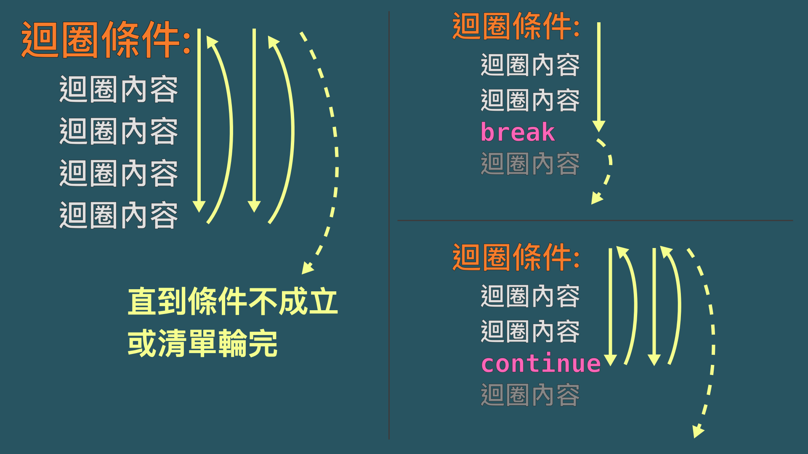

# 第二章：控制程式流程 - if

本章互動式執行環境: https://colab.research.google.com/drive/1KVIxPyWXE1kgKFXr02cDAf0WjzI8FT9g?usp=sharing

## 如果怎樣，就那樣？
程式除了由上到下每一行執行以外，也可以做判斷並分支

```python
egg_price = 30

if egg_price > 10:
    # 分支一
    print("蛋好貴！")
    print("不吃蛋了！")
else:
    # 分支二
    print("買顆蛋吧")

print("心累")  # 不在分支內了，一定會執行

# 如果蛋超過 10 塊，就印出「蛋好貴！」「不吃蛋了！」兩行
# 否則（蛋沒超過 10 塊），就印出「買顆蛋吧」一行
# 不是這個就是那個；不會兩邊都執行

# 但最後一行的「心累」一定會印出，請看下面解釋！
```

因為用 "if" 跟 "else" 這兩個關鍵字控制程式的走向，所以叫 "if-else"：根據「判斷式」的真假，執行相對應的「分支」

第一：`egg_price > 10` 是一個判斷式；判斷式的結果會是「真」(`True`) 或「假」 (`False`)

第二：`if` 判斷式與 `else` 的後面都要加冒號 `:`

第三：在 if-else 裡面的分支可以放一堆指令，但這些指令前面必須加**四個空白**。當某一行前面沒加空白，就表示這分支結束了，不再是判斷 if-else 了，所以無論蛋貴不貴都會繼續執行

### 縮排 (indent)

這種「前面加四個空白」叫做「縮排」，代表程式碼一種「階層」的感覺




### 數字的比較

我們可以用下面其中一種方式比較兩個數字，當作一個判斷式

* `==` 相等嗎？
* `!=` 不相等嗎？（不相等的話為 `True`）
* `>` 大於嗎？
* `>=` 大於或等於嗎？
* `<` 小於嗎？
* `<=` 小於或等於嗎？

### 可以只有 if 沒有 else

```python
egg_price = 20

if egg_price < 10:
    print("便宜！")

# 不會印任何東西
```

如果不寫 `else`，當判斷式錯誤時，不會執行在 if 內的分支

## 資料類型：bool (布林)

python 裡能呈現的資料的型別、型態其實很多種，除了數字 `123` 跟字串 `"abc"` 以外，還有個型態叫 `bool` (布林, boolean)，表示「是否」

判斷式的「結果」就是一個布林型態的值，只會有兩種可能 `True` 或者 `False` -- 這兩個字可以直接拿來用（注意，沒有引號唷！）

所以下列這兩個程式是等價的

```python
# 程式 1
if 2 + 2 == 4:
    print("1984")

# 程式 2
if True:
    print("1984")
```

### 看資料型態: `type()`

題外話，你可以用 `type()` 來看一個值或變數的資料型態

```python
# 會先把 2+2 == 5 這個式子判斷出來，把結果存到 yes_no
yes_no = (2 + 2 == 5)
n = 2 + 2
s = "一二三"

print(type(yes_no))  # <class 'bool'>
print(type(n))       # <class 'int'>, int 是整數
print(type(s))       # <class 'str'>
```

下一章馬上介紹更多的資料類型唷！

## if-else 本身是命令，可放在另一個 if-else 內

如果把程式當成一連串的指令，if-else 整體來看本身也是個指令，所以可以放在另一個 if-else 的分支內

```python
price = 50

if price < 10:
    print("便宜")
else:
    print("好像有點貴？")
    if price > 100:
        print("超貴！")
    else:
        print("原來還能接受")

# 先判斷「小於 10 元嗎」，因為不是
# 跑到第一層的 else 分支，裡面區塊起碼要四格空白開頭
# 第二層的 if-else 判斷的分支，要比第一層再多四格空白，也就是 8 格
```

上面程式會印兩行
```
好像有點貴？
原來還能接受
```

## python 特有的 `elif`

if-else 是個很基本的概念，許多程式語言都有語法寫出這種概念

但 python 還多一個特殊的關鍵字 `elif`, 代表 else if，是在同一層不斷地一直做判斷

```python
price = 90

if price < 10:
    print("便宜")
elif price < 20:
    print("有點貴")
elif price < 100:
    print("算滿貴的")
else:
    print("超貴的！")

print("累累")
# 最後印兩行「算滿貴的」跟「累累」
```

這個同一層的判斷，會依序由上到下，只要到某個判斷式正確了，就會執行那個分支，剩下的判斷式就不管了

## 考驗你懂不懂！

這個程式會印什麼？

```python
x = 50

if x < 100:
    if x > 70:
        print("比 70 大")
    else:
        print("沒超過 70")
elif x < 1000:
    if x >= 50:
        print("大於或等於 50")
    else:
        print("比 50 小")
else:
    if x > 200:
        print("比 200 大")
```

快去互動式執行環境，驗證你的答案！ https://colab.research.google.com/drive/1KVIxPyWXE1kgKFXr02cDAf0WjzI8FT9g?usp=sharing

分析：第一層的 if-else 有三個判斷
```
小於 100 嗎？
還是小於 1000 呢？
還是以上皆非呢？
```
這三個判斷是同一層，由上到下依序判斷，**只要碰到一個正確了就不管「第一層」其他的判斷了**

因此，因為 x 是 50 已經「小於 100」了，所以就算後面有判斷「還是小於 1000 呢？」也沒作用了。程式的流程會繼續判斷下一層的 `x > 70` 。所以最後答案會印 `沒超過 70`

另一個角度來看，因為凡是會 `x < 100` 的一定滿足 `x < 1000`，所以寫出第一層這樣的 if-elif-else 邏輯上會很奇怪。雖然語法上是對的，但語意上有點問題

## 小結

在這章你學到了
* if-else 流程控制
* 縮排代表一種階層、區塊
* 另一種資料型態: bool 布林 (`True` 與 `False`)
* 用 `type()` 看某個變數/值的資料型態
* python 獨有的 `elif`

除了數字、字串、布林以外，python 還有哪些資料型態？請看下一章！

想看更多額外的教學的話：
* https://docs.python.org/zh-tw/3.13/tutorial/controlflow.html#if-statements