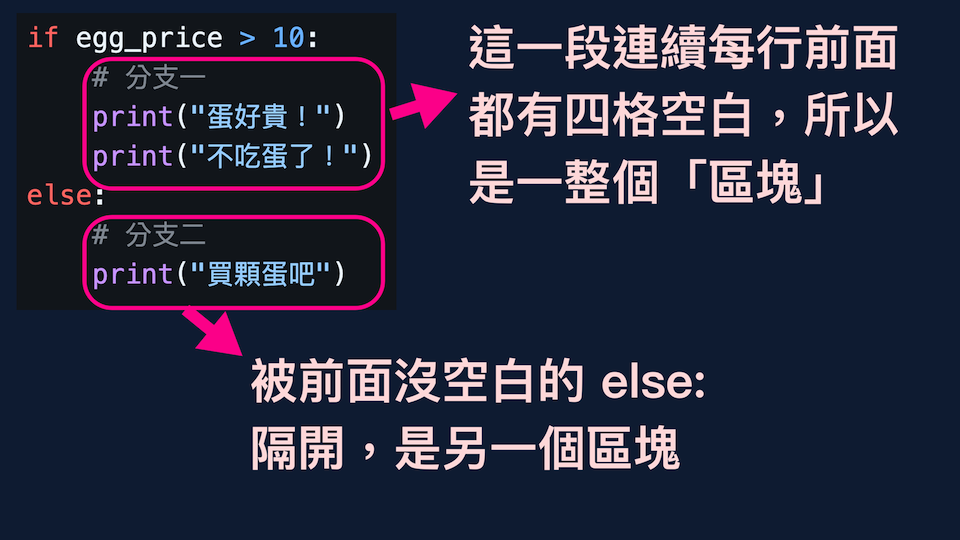

# 第四章：控制程式流程 - 迴圈 (while & for)

本章互動式執行環境: https://colab.research.google.com/drive/15wF7Yipprlkl1uB1vH7Qw6RbxXitjHb2?usp=sharing

## 迴圈 ~ 重複做某件事

我們時常需要重複做某件事情，例如
* 一直花錢買東西、買東西、買東西，直到錢不夠
* 把播放清單每首歌都聽過
* 從 1 + 2 + 3 ... 加到 1000

這種概念叫做「迴圈」，Python 有兩種指令可以達成：`while` 或 `for`


## `while`: 不斷檢查是否繼續做

`while` 概念是：先檢查要不要做事（迴圈條件），要的話就做（迴圈內容），做完以後再重新做檢查，不斷重複

```
while 條件判斷:
    # 縮排區塊
    做事
```

所以「一直花錢買東西，直到錢不夠」，會寫成這樣

```
while 錢還夠的話:
    買東西
```

例如下面這個程式，代表你原本有多少錢，只要錢還大於等於某個數目，就能不斷買東西

```python
stone = 20

while stone >= 5:
    print("我還有幾顆寶石: " + str(stone))
    stone = stone - 5
    print("花五顆買衣服...")

print("剩這些寶石了: " + str(stone))
```

```
我還有幾顆寶石: 20
花五顆買衣服...
我還有幾顆寶石: 15
花五顆買衣服...
我還有幾顆寶石: 10
花五顆買衣服...
我還有幾顆寶石: 5
花五顆買衣服...
剩這些寶石了: 0
```

`while` 後面接的是判斷式（加冒號），跟 `if` 一樣。

題外話，也跟 `if` 一樣，你可以寫 `while True:`，迴圈條件永遠是「真」，所以會不斷執行。後面教你怎麼跳出無窮迴圈。


## `for`: 對某一串東西依序做事

`for` 的概念是，對一串東西裡的每一個依序做某些事，例如播放清單、學生點名、吃過菜單上每一道菜等等。

最具代表性的是跟 list 搭配，直接看例子

```python
for song in ["周杰倫", "蔡依林", "Taylor Swift"]:
    print("播放 -> " + song)
```

會出現

```
播放 -> 周杰倫
播放 -> 蔡依林
播放 -> Taylor Swift
```

縮排裡的區塊是迴圈要做的事，`for ... in ...` 會把清單內每個東西依序給前面的變數，然後讓迴圈做事。所以上面的例子，因為清單有三個東西，所以迴圈會做三次，每一次的 `song` 的值都不一樣

注意，for 迴圈只是看過 list 每一個元素，不會真的把它拿出來刪掉


## `range()`: 來數數！

如果你想從 1 數到 1000, 在程式碼裡打字 `[1, 2, 3, ...` 一直寫到 1000 很不實際，太長了！不過 python 提供 `range()`，可以幫你生成這些數字。有三種用法

* `range(5)` -> 0, 1, 2, 3, 4
* `range(1, 5)` -> 1, 2, 3, 4
* `range(1, 11, 2)` -> 1, 3, 5, 7, 9

如果只給一個數字 `range(終點)` 會從 **0** 開始數，而且不會數到「大於等於」終點。所以 `range(5)` 裡的數字都會「小於」5。總共會有 5 個數字，跟 list 編號很像

如果給兩個數字 `range(起點, 終點)` 會從起點數。終點是同樣道理。所以 `range(3,8)` 是 3, 4, 5, 6, 7，數量剛好會有 8-3=5 個

如果給三個數字 `range(起點, 終點, 變量)`, 表示每一次數數都會加「變量」上去；第三個數字是 2 的話，就是從 1, 1+2, 1+2+2, ... 一直數

起點、終點、變量都必須是整數

`range(1, 11, 2)` 跟 `range(1, 10, 2)` 都一樣是 1, 3, 5, 7, 數了 9 以後結束。想一想為什麼（提示：要比終點小）

所以從 1 加到 1000 的話，可以用 `range()` 數數，把它給 `for ... in ...` 一個個處理

```python
sum = 0
for number in range(1, 1001):
    sum = sum + number

print(sum)

# number 會從 1, 2, ... 一直下去
# 類似 for number in [1,2,3]，但不需要打很多字打到 1000
# 會是 1 加到 1000, 不是加到 1001 唷
```

數字連加也可以用迴圈算：拿一個變數 `sum` 隨時記著目前的加總（所以一開始是零，因為還沒加任何東西），讓數字 `number` 從 1 數到 1000，重複做著「把數字跟前一次的加總加起來」的事情

## 看過清單每個元素

* `for` 的概念是：對一串東西裡的每一個依序做某些事
* `while` 概念是：先檢查要不要做事，要的話就做，做完以後再重新做檢查，不斷重複

雖然想法不同，但是在某些用途，可以用不同的寫法達到一樣效果

例如你想要「紅茶拿鐵」、「綠茶拿鐵」、「烏龍拿鐵」的話

```python
tea_list = ["紅茶", "綠茶", "烏龍"]

# 方法一：用 for .. in 清單，直接掃過一遍每種茶

for tea in tea_list:
    print(tea + "拿鐵")
```

```python
tea_list = ["紅茶", "綠茶", "烏龍"]

# 方法二：想成編號 0 號、編號 1 號、跟編號 2 號茶

amount = len(tea_list) # 3
for i in range(amount):
    # i 依序會是 0, 1, 2，剛好就是編號
    print(tea_list[i] + "拿鐵")
```

```python
tea_list = ["紅茶", "綠茶", "烏龍"]

# 方法三：類似方法二，用編號
# 但是想成「編號要小於 3」這個條件，符合這個條件才去從茶清單拿

i = 0  # 編號
while i < len(tea_list):
    print(tea_list[i] + "拿鐵")
    i = i + 1  # 編號要數下一個了
               # 如果編號不增加，永遠是零的話，
               # 就會一直選「紅茶」，變無窮迴圈
```

只是單純看過清單每個元素的話，方法一最好。但是你應該要「理解」為什麼另外兩個語法這樣寫也會正確


## 巢狀迴圈

就像 if-else 可以放在另一個 if-else, for 迴圈或是 while 迴圈本身也能看成一個整體、一個區塊所所以迴圈裡面可以放迴圈（甚至後面一段能看到各類指令的配合）

```python
for month in ["五月", "六月", "七月"]:
    for week in ["第一個禮拜", "第二個禮拜"]:
        print(month + week + "運動")

    print("剩下" + month + "休息")
```

會輸出

```
五月第一個禮拜運動
五月第二個禮拜運動
剩下五月休息
六月第一個禮拜運動
六月第二個禮拜運動
剩下六月休息
七月第一個禮拜運動
七月第二個禮拜運動
剩下七月休息
```

`for month in ["五月", "六月", "七月"]:` 是最「外層」的迴圈，因為是由上到下的第一行，所以流程是
1. 讓 `month` 是五月，做「裡面的事」
2. 讓 `month` 是六月，做「裡面的事」
3. 讓 `month` 是七月，做「裡面的事」

這個裡面的事，就是縮排內的指令，包括 `for week in ...` 的迴圈，以及「剩下 month 休息」這一行都做完，month 才會換下一個月。


## break 與 continue

在迴圈裡面有兩個指令可以改變流程
* `break` -- 「馬上跳出」迴圈，不執行縮排內剩下的指令，也不去數數、不管清單還沒處理的東西
* `continue` -- 「提前進行下一輪」，暫時當作縮排內剩下的指令不存在，馬上去數下一個，或是處理清單下一個東西



通常 `break` 或 `continue` 會搭配條件判斷一起用（否則第一次就 break 跳出去，或每一次 continue 提早下一輪，都有點多餘）

### 看準時機跳出迴圈

```python
money = 0
while True:  # 原本會無窮迴圈
    # 賺錢
    money += 100

    # 但賺超過 500 就跳出
    if money > 500:
        break

print(money)  # 600
```

`break` 因為在 `if money > 500:` 判斷裡面，所以 money 要大於 500 以後，break 才會真的執行

### 條件成立才提前進下一輪

```python
for score in [60, 59, 89, 46, 64]:
    print("學生分數: " + str(score))

    # 如果不及格，就跳過後面的恭喜，提前看下一個學生的分數
    if score < 60:
        continue

    print(str(score) + " 恭喜通過")
```

印出
```
學生分數: 60
60 恭喜通過
學生分數: 59
學生分數: 89
89 恭喜通過
學生分數: 46
學生分數: 64
64 恭喜通過
```

上面兩個例子太簡單，所以有更簡潔的寫法。但是邏輯很複雜時，適當的 `break` 或 `continue` 很有用！


## 小結

在這章你學到了
* `while` 迴圈：檢查要不要做事，要的話就做，做完後重新檢查，不斷重複
* `for` 迴圈：對一串東西裡的每一個依序做事
* `range()`：數數，生出一串東西（可以給 `for` 用）
* 巢狀迴圈
* `break`「馬上跳出」迴圈
* `continue` 「提前進行下一輪」

想看更多額外的教學的話：
* https://docs.python.org/zh-tw/3.13/tutorial/controlflow.html#

---

前四章學了變數，學了資料類型：數字、字串、真假跟串列/清單，也學了流程控制 if, while, for 等等的語法。但學這些有什麼用？

這些是基礎的思考，像樂高積木一樣，搭建起來就能解決很多生活上的問題。python 語法雖然重要，但他們代表的概念更重要。下一章會介紹這些「變數」、「流程」、「資料型態」怎麼解決問題，就算你忘記了 python 語法！